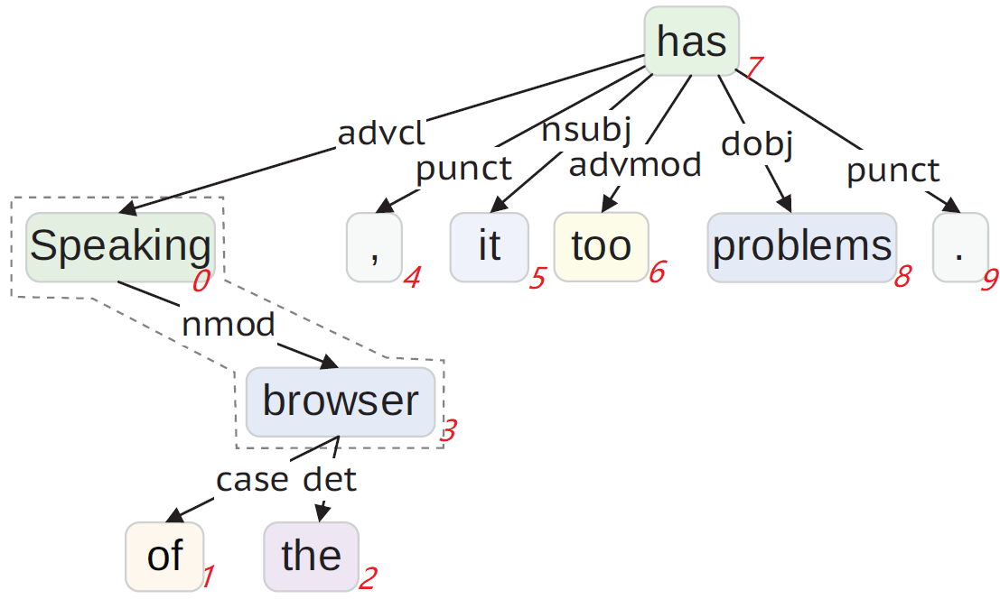

# BiDTree: Improving Aspect Term Extraction with Bidirectional Dependency Tree Representation

This repo contains the code of the following paper:

*[Improving Aspect Term Extraction with Bidirectional Dependency Tree Representation](https://arxiv.org/pdf/1805.07889.pdf). 
Huaishao Luo, Tianrui Li, Bing Liu, Bin Wang and Herwig Unger. TASLP, 2019, 27(7):1201-1212.*

This paper proposes a bidirectional dependency tree network to extract 
dependency structure features from the given sentences to 
improve the performance of aspect term extraction (ATE).

## Requirements

* python 2.7
* tensorflow==1.2.0

```
pip install -r requirements.txt
```

## Running

##### preprocess
```
python main.py --do_preprocess
```

##### train
```
python main.py --do_train --do_evaluate --lr 0.001 --batch_size 20 --nepochs 100
```

See [main.py](./main.py) for more training arguments.

## Approach of Model Dependency Tree (An Example)

Here is an example to briefly introduce the structure information we 
need to organize in our model progress. It is complex due to the arbitrary 
layer's number and dependent nodes' number in a dependency tree. No matter 
in bottom-up manner or top-down manner, we need to firstly compute the 
nodes which lie in the bottom of the layers.

**Sentence** 

```
Speaking_0 of_1 the_2 browser_3 ,_4 it_5 too_6 has_7 problems_8 ._9
```

**Bottom-up**

```
[8, 3, 5, 7, 0, 2, 6, 9, 4, 1]
[u',', u'.', u'it', u'of', u'problems', u'the', u'too', u'browser', u'Speaking', u'has']
[[], [], [], [], [], [], [], [3, 5], [7], [8, 0, 2, 6, 4, 1]]
[[], [], [], [], [], [], [], [u'case', u'det'], [u'nmod'], [u'advcl', u'punct', u'nsubj', u'advmod', u'dobj', u'punct']]
[0, 0, 0, 0, 0, 0, 0, 2, 1, 6]
[4, 9, 5, 1, 8, 2, 6, 3, 0, 7]
```

> **2nd:** new sequence used to model bottom-up dependency information <br>
> **1st:** id of new sequence used to map back to orignal sequence <br>
> **3rd:** dependent token id of each token (new sequence) <br>
> **4th:** dependent token of each token (new sequence) <br>
> **5th:** dependent token number of each token (new sequence) <br>
> **6th:** id of orignal sequence used to map to new sequence 

**Top-down**

```
[1, 6, 4, 2, 9, 7, 3, 0, 5, 8]
[u'has', u'Speaking', u'browser', u'too', u'the', u'problems', u'of', u'it', u'.', u',']
[[], [0], [1], [0], [2], [0], [2], [0], [0], [0]]
[[u'I_ROOT'], [u'I_advcl'], [u'I_nmod'], [u'I_advmod'], [u'I_det'], [u'I_dobj'], [u'I_case'], [u'I_nsubj'], [u'I_punct'], [u'I_punct']]
[0, 1, 1, 1, 1, 1, 1, 1, 1, 1]
[7, 0, 3, 6, 2, 8, 1, 5, 9, 4]
```

> Each line has the same meaning with the Bottom-up

**Dependency tree (with red orginal id)**

<p>

</p>


## Citation

If the paper or this repository is helpful, please cite as:

```
@Article{Luo2019,
    author = {Huaishao Luo and Tianrui Li and Bing Liu and Bin Wang and Herwig Unger},
    title = {Improving Aspect Term Extraction with Bidirectional Dependency Tree Representation},
    journal = {IEEE/ACM Transactions on Audio, Speech, and Language Processing},
    year = {2019}, 
    volume = {27}, 
    number = {7}, 
    pages = {1201-1212},
    doi = {10.1109/TASLP.2019.2913094}
}
```
